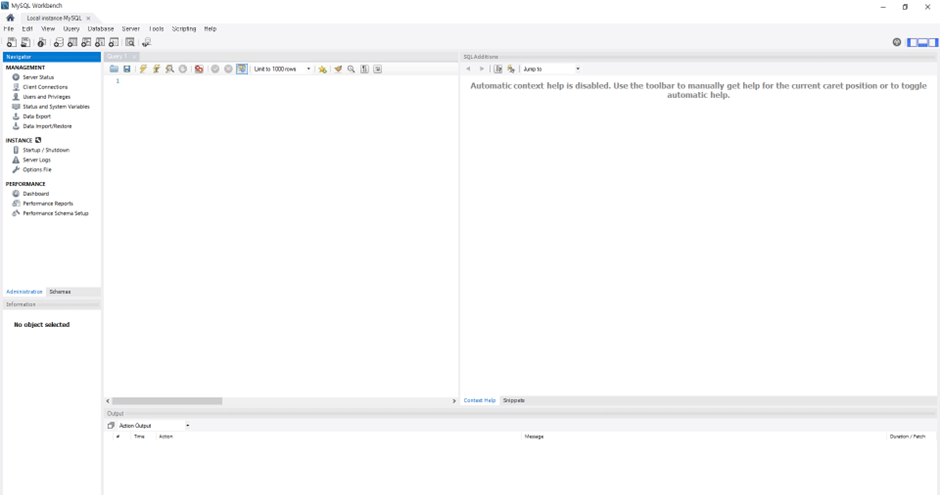

# SQL_ADVANCED 1주차 정규 과제 

📌SQL_ADVANCED 정규과제는 매주 정해진 분량의 『*혼자 공부하는 SQL*』 을 읽고 학습하는 것입니다. 이번주는 아래의 **SQL_ADVANCED_1st_TIL**에 나열된 분량을 읽고 공부하시면 됩니다.

아래의 문제를 풀어보며 학습 내용을 점검하세요. 문제를 해결하는 과정에서 개념을 스스로 정리하고, 필요한 경우 제시된 강의를 참고하여 보완하는 것이 좋습니다.

<!-- 강의 링크는 아래와 같습니다.
https://www.youtube.com/watch?v=0cRhit1EJM0&list=PLVsNizTWUw7GCfy5RH27cQL5MeKYnl8Pm&index=1
https://www.youtube.com/watch?v=6JFEJWLcKUc&list=PLVsNizTWUw7GCfy5RH27cQL5MeKYnl8Pm&index=2
https://www.youtube.com/watch?v=8r1W_7nuo2U&list=PLVsNizTWUw7GCfy5RH27cQL5MeKYnl8Pm&index=3
https://www.youtube.com/watch?v=j2DAiY-OXGs&list=PLVsNizTWUw7GCfy5RH27cQL5MeKYnl8Pm&index=4
https://www.youtube.com/watch?v=EftIRlr6rPI&list=PLVsNizTWUw7GCfy5RH27cQL5MeKYnl8Pm&index=5
https://www.youtube.com/watch?v=lBk5YhLZevs&list=PLVsNizTWUw7GCfy5RH27cQL5MeKYnl8Pm&index=6
-->

**교재 실습 예제 파일은 07_SQL_ADVANCED_Template 레포지토리의 src 폴더에 업로드되어 있습니다. market_db 파일도 해당 폴더에 함께 포함되어 있으니 참고하시기 바랍니다.**

**👀(수행 인증샷은 필수입니다.)** 

## SQL_ADVANCED_1st_TIL

### 1장 데이터베이스와 SQL
#### 01. 데이터베이스 알아보기
#### 02. MySQL 설치하기
### 2장 실전용 SQL 미리 맛보기
#### 01. 건물을 짓기 위한 설계도: 데이터베이스 모델링
#### 02. 데이터베이스 시작부터 끝까지
#### 03. 데이터베이스 개체 


## Study Schedule

| 주차  | 공부 범위     | 완료 여부 |
| ----- | ------------- | --------- |
| 1주차 | p.24~99    | ✅         |
| 2주차 | p.102~155   | 🍽️         |
| 3주차 | p.158~213  | 🍽️         |
| 4주차 | p.216~271 | 🍽️         |
| 5주차 | p.274~327 | 🍽️         |
| 6주차 | p.330~369 | 🍽️         |
| 7주차 | p.372~407 | 🍽️         |


<br>

<!-- 여기까진 그대로 둬 주세요-->

---

# 1️⃣ 학습 내용 정리

## 1. 데이터베이스 알아보기

<!-- 데이터베이스와 DBMS에 관해 배우게 된 점을 적어주세요. -->

> **확인문제: 다음 소프트웨어 중에서 DBMS가 아닌 것을 모두 고르세요.**

> MySQL / Excel / Oracle / SQL Server / MariaDB

```
Excel
```


## 2. MySQL 설치하기

<!-- 이번 챕터는 개념정리 없이 MySQL 설치 후 인증사진으로 대체합니다. -->




## 3. 건물을 짓기 위한 설계도: 데이터베이스 모델링

<!-- 데이터베이스 모델링에 관해 배우게 된 점을 적어주세요. -->

> **확인문제: 다음은 폭포수 모델의 절차입니다. 차례대로 나열해보세요.**

> 시스템 설계 / 테스트 / 프로그램 구현 / 프로젝트 계획 / 업무 분석 / 유지보수

```
프로젝트 계획 / 업무 분석 / 시스템 설계 / 프로그램 구현 / 테스트 / 유지보수
```


## 4. 데이터베이스 시작부터 끝까지 

<!-- 이번 챕터는 개념정리 없이 실습 인증사진으로 대체합니다. 강의를 수강하고, 실습 과정이 보이도록 인증사진 3-4장을 아래에 제출해주세요. -->

<!-- 이 부분을 지우고 인증사진을 제출해주세요.-->


## 5. 데이터베이스 개체

<인덱스(Index): 데이터 조회 속도를 획기적으로 높여주는 개체
    - 책의 '찾아보기'와 같은 원리로, 데이터가 방대할 때 전체 테이블을 다 뒤지는 '전체 테이블 스캔(Full Table Scan)' 대신 인덱스를 통해 빠르게 원하는 정보만 찾아낼 수 있음

뷰(View): '가상의 테이블'로, 실제 데이터를 가지고 있지는 않지만 테이블과 링크되어 마치 테이블처럼 작동
    - 바탕화면의 바로가기 아이콘과 유사한 개념이며, 보안상 중요한 데이터를 숨기거나 복잡한 쿼리를 단순하게 만드는 데 활용

스토어드 프로시저(Stored Procedure): 여러 개의 SQL 문을 하나로 묶어 프로그래밍 언어처럼 사용할 수 있게 해주는 개체
    - 자주 사용하는 쿼리 뭉치를 저장해 두었다가 CALL 예약어로 간편하게 실행할 수 있어 효율적>


<!-- 인덱스, 뷰, 스토어드 프로시저 실습을 각각 진행한 후, 각 실습에 대한 인증 사진을 1장씩 제출해 주세요. -->

<!-- 이 부분을 지우고 인증사진을 제출해주세요.-->

---

# 2️⃣ 실습과제

> SQL ADVANCED 과정은 별도의 확인문제가 없습니다. 다음 주부터는 확인문제 대신 제공되는 실습용 테이블을 활용하여, 배운 내용을 직접 적용하는 실습형 과제로 진행됩니다.

> 이번주는 개강과 함께 새로운 학기가 시작된 만큼, 학기 초 일정에 천천히 적응하시며 부담 없는 한 주 보내시길 바랍니다. 😊

### 🎉 수고하셨습니다.


